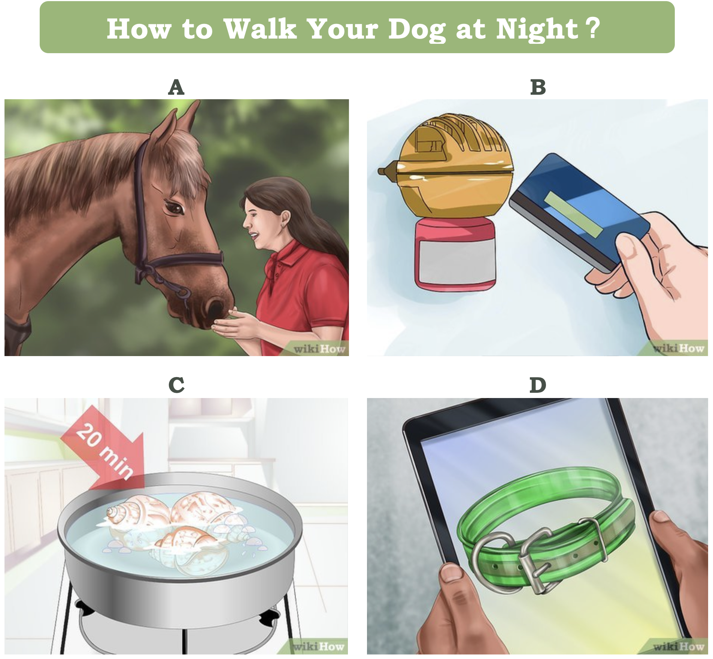

# wikiHow-VGSI

The dataset and baseline model of EMNLP 2021 paper [Visual Goal-Step Inference using wikiHow](https://arxiv.org/abs/2104.05845).

<p float="left">
  
   
</p>


## Dataset
The dataset is available [here](https://drive.google.com/drive/folders/1hjjcNSUSqv8AbA7R-5lIKmui-ySCEWJw?usp=sharing), it contains the following files:
	
* **wiki_images.zip**: all 770k images {*image_id.png*}
* **WikihowText_data.json**: json file of the textual annotation data, each line has the following structure: 

```
{'file_id': article ID (str, e.g. 10000798),
 'goal': textual goal (str, e.g. 'How to Hang an Ironing Board'),
 'goal_description': description of the goal (str),
 'category_hierarchy': (list of str),
 'methods': [{'name': 'Hanging an Ironing Board Over a Door',
   'steps': [{'headline': 'Find a door to hang your ironing board.',
     'description': (str),
     'img': url of image,
     'img_license': 'Creative Commons',
     'step_id': '10000798_0_0'},
     ...
     ]
  ...
  ]
```
Use the following code to read the json file:

```pythom
import json
articles = []
for line in open("WikihowText_data.json", "r"):
    articles.append(json.loads(line))
```

## Baseline Models
Check this [notebook](https://colab.research.google.com/drive/1icPEkzpcRn4OvTY8rVjDqMtMf76JmdO7?usp=sharing) for the baseline model.

## Board Game
There is a `wikiHow to Meme` board game which is similar to our VGSI task. During each round of the game, an image card describing a step is given and each player needs to select one textual card describing a goal which is the most suitable to the image card. [Here](https://wikihow.shopping/products/wikihow-meme-game) is the purchasing link of the game. There is also a [printable version](https://mcusercontent.com/7d3ca675de04729b75ecca92b/files/d4d290a6-7c9e-5c3f-3544-c953d62777bb/wikiHow_to_Meme_Print_and_Play_User_Guide.pdf?mc_cid=0b12b9cb34&mc_eid=2263cd265d).

## Cite
Please cite our work if you think it is useful. Thank you!

```
@article{yang2021visual,
  title={Visual Goal-Step Inference using wikiHow},
  author={Yang, Yue and Panagopoulou, Artemis and Lyu, Qing and Zhang, Li and Yatskar, Mark and Callison-Burch, Chris},
  journal={arXiv preprint arXiv:2104.05845},
  year={2021}
}
```
   
	

